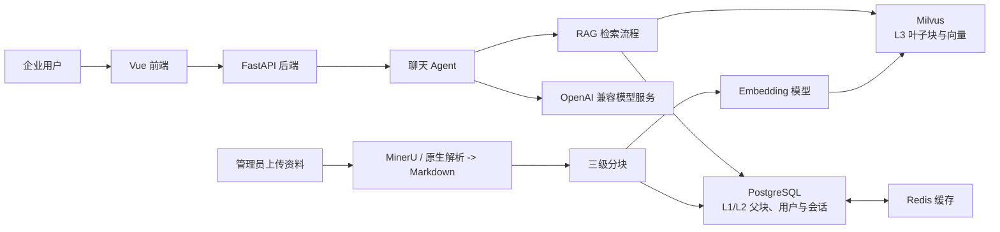

# 企业知识库智能问答系统

面向企业内部资料的 RAG 问答系统。管理员上传制度、流程、项目文档、产品手册或 FAQ 后，系统先检索可追溯的原文证据，再生成带引用的回答。

项目不绑定特定行业或预置业务语料。知识库内容、问题口径和评测集都应由实际接入的企业资料决定。

> RAG 可以理解为：先从已入库资料中找证据，再依据证据回答。它适合相对稳定的知识；实时数据、审批动作和业务交易应通过独立 API 或工具接入。

## 核心能力

- 支持 Markdown、TXT、HTML，以及 PDF、DOCX、PPTX、XLSX 和常见图片上传。
- 富文档统一通过 MinerU 转为 Markdown；保留原文件、Markdown、结构化清单和解析资源，RAG 只使用 Markdown 分块。
- 使用 L1/L2/L3 三级父子分块：L3 精确召回，L1/L2 在命中后恢复完整上下文。
- 使用 BGE-M3 稠密向量与 Milvus 原生 BM25 混合检索，并以 RRF 融合排序；混合检索异常时可降级为纯向量检索。
- 对证据进行相关性、可回答性和歧义判断；证据不足时最多执行一次 Step-back 或 HyDE 改写检索。
- 支持复杂问题拆分为子问题并行检索、SSE 流式输出、停止生成、来源引用和 RAG 过程展示。
- 支持账号登录、会话隔离、管理员文档管理和会话摘要记忆。

## 架构概览



| 组件 | 职责 |
| --- | --- |
| Vue 3 + Vite | 登录、聊天、文档管理、来源与检索过程展示。 |
| FastAPI | 认证、会话、上传任务、聊天接口与 SSE 流式响应。 |
| PostgreSQL | 用户、会话消息和 L1/L2 父级分块。 |
| Redis | 父级分块和会话相关缓存。 |
| Milvus 2.5+ 或 Zilliz Cloud | L3 叶子块、稠密向量和服务端 BM25 稀疏特征。 |
| MinerU | 富文档转 Markdown，并保留可追溯解析产物。 |
| OpenAI 兼容模型服务 | 复杂度判断、证据判断、查询改写和最终回答。 |

## 文档入库

上传文件不会直接覆盖已有同名资料，而是按以下顺序执行：

1. 将原文件写入任务独立的暂存目录。
2. PDF、DOCX、PPTX、XLSX、PNG、JPG、WEBP、BMP、TIFF 仅经 MinerU 转换；Markdown、TXT、HTML 使用原生解析。
3. 将得到的 Markdown 切成三级关联块，并验证至少生成一个可检索的 L3 叶子块。
4. 校验成功后，清理同名旧文档的 Milvus 向量、PostgreSQL 父块和解析产物，再提升新文件与新产物包。
5. L1/L2 写入 PostgreSQL，L3 生成向量后写入 Milvus。

MinerU 转换或分块失败会明确报错，旧版本不会被删除，也不会静默改用其他解析器。旧版 `.doc`、`.xls` 不支持，请先转换为 DOCX 或 XLSX。

| 层级 | 默认长度 / 重叠 | 存储位置 | 用途 |
| --- | --- | --- | --- |
| L1 | 2400 / 400 字符 | PostgreSQL + Redis 缓存 | 保存较完整的章节上下文。 |
| L2 | 1600 / 200 字符 | PostgreSQL + Redis 缓存 | 在上下文完整性和定位精度之间折中。 |
| L3 | 800 / 100 字符 | Milvus | 最小可检索单元，用于精确召回。 |

## 检索与回答

1. 简单问题直接检索；复杂问题由 `FAST_MODEL` 规划 2-4 个可独立检索的子问题。
2. 先使用稠密向量和 BM25 混合召回 L3；多个叶子块命中同一父块时自动回取 L2/L1。
3. 可选 Rerank 服务对候选证据精排。是否实际启用以回答 trace 中的 `rerank_applied` 为准。
4. `GRADE_MODEL` 判断证据是否相关、充分或存在歧义。评分失败时流程保守结束，不以未经验证的片段直接回答。
5. 证据不足时只选择 Step-back 或 HyDE 中的一种重写方式，并且只进行一次二次检索。
6. 最终回答仅依据检索证据，用 `[1]`、`[2]` 标注来源；资料不足时明确说明无法确认。

## 快速开始

### 前置条件

- Windows 10/11、PowerShell 5.1 或 PowerShell 7。
- Docker Desktop、Python 3.12+、[uv](https://docs.astral.sh/uv/)、Node.js 20+ 与 npm。
- 可用的 OpenAI 兼容模型服务和 Embedding 模型。
- 已部署的 MinerU Gradio 服务，默认地址为 `http://127.0.0.1:7860`。启动脚本不会自动启动 MinerU。
- Milvus 可以使用本地 Docker，也可以使用 Zilliz Cloud 等托管服务。

云端 Milvus 配置：

```dotenv
MILVUS_URI=https://你的云端公开地址
MILVUS_TOKEN=你的访问令牌
MILVUS_COLLECTION=embeddings_collection
```

配置 `MILVUS_URI` 后，后端会优先使用完整地址，并在存在 `MILVUS_TOKEN` 时进行鉴权；本地模式仍使用 `MILVUS_HOST` 和 `MILVUS_PORT`。云端模式下服务器不需要启动本地 Milvus、etcd、MinIO 和 Attu，只保留 PostgreSQL、Redis 与应用服务即可。

### 首次准备

```powershell
uv sync
Set-Location .\frontend
npm install
Set-Location ..
```

在根目录配置 `.env`，不要提交密钥：

```dotenv
BASE_URL=
ARK_API_KEY=
MODEL=
FAST_MODEL=
GRADE_MODEL=
JWT_SECRET_KEY=

EMBEDDING_MODEL=BAAI/bge-m3
EMBEDDING_DEVICE=cpu
EMBEDDING_LOCAL_FILES_ONLY=true

MINERU_URL=http://127.0.0.1:7860
MINERU_BACKEND=hybrid-engine
MINERU_ENGINE_URL=http://localhost:30000

# 默认使用本地或自建的 MinerU Gradio 服务；需要官方云端 API 时再改为 official_api
MINERU_PROVIDER=gradio
# MINERU_PROVIDER=official_api
MINERU_API_BASE_URL=https://mineru.net/api/v1/agent
MINERU_API_KEY=
MINERU_POLL_INTERVAL_SECONDS=3
MINERU_API_TIMEOUT_SECONDS=600
```

`MINERU_PROVIDER` 默认为 `gradio`，对应自建的 Gradio 服务；设为 `official_api` 后，项目会通过 MinerU 官方接口执行“创建任务、上传文件、等待解析、下载 Markdown”。官方模式必须配置 `MINERU_API_KEY`，密钥只放在本地 `.env`，不要提交。两种模式输出相同的 Markdown 和解析产物，后续分块与入库流程不变。

可选配置包括 `MINERU_END_PAGES`、`MINERU_FORCE_OCR`、`MINERU_FORMULA_ENABLE`、`MINERU_TABLE_ENABLE`、`MINERU_IMAGE_ANALYSIS`、`MINERU_EFFORT`、`MINERU_LANGUAGE`、`MINERU_POLL_INTERVAL_SECONDS`、`MINERU_API_TIMEOUT_SECONDS`、`RERANK_MODEL`、`RERANK_BINDING_HOST`、`RERANK_API_KEY`、`RETRIEVAL_TOP_K`、`AUTO_MERGE_THRESHOLD`。

### 启动与停止

```powershell
pwsh -NoLogo -NoProfile -File .\scripts\supermew.ps1 -Action start
pwsh -NoLogo -NoProfile -File .\scripts\supermew.ps1 -Action stop
pwsh -NoLogo -NoProfile -File .\scripts\supermew.ps1 -Action restart
pwsh -NoLogo -NoProfile -File .\scripts\supermew.ps1 -Action status
```

也可使用根目录 `start.bat` 和 `stop.bat`。服务地址：

- 前端：<http://127.0.0.1:3000/>
- 后端健康检查：<http://127.0.0.1:8050/health>
- FastAPI 文档：<http://127.0.0.1:8050/docs>

## 使用方式

1. 注册账号并登录；管理员可进入“知识库”上传、查看和删除资料。
2. 上传企业制度、项目文档、产品手册、FAQ 等资料，等待 MinerU、分块、父块入库和向量入库完成。
3. 在聊天页提出与已上传资料有关的问题。
4. 在回答下方查看引用来源和 RAG trace，区分“未找到资料”“证据不足”和“生成回答”。

## RAG 评测

项目保留通用评测脚本，但不内置某个行业的数据集。为目标知识库准备 JSONL 题集后，每道题应至少包含：

```json
{"id":"hr-probation-001","question":"试用期最长多久？","expected_docs":["员工手册.md"],"expected_facts":["试用期最长为六个月"],"must_not_claim":["试用期必须为六个月"]}
```

运行评测时必须显式提供题集，防止错用与当前知识库无关的旧数据：

```powershell
$env:EVAL_PASSWORD = '<评测账户密码>'
uv run python .\scripts\run_rag_baseline.py `
  --cases .\data\evaluation\test-cases.jsonl `
  --username '<评测账户用户名>' `
  --output .\output\rag-evaluations\run.jsonl
```

默认调用独立模型判卷；使用 `--answer-grading off` 可只验证检索结果。脚本会生成逐题 JSONL、汇总 JSON 和 Markdown 成绩单。新的语料、题集和完整运行结果建立后，才能把对应指标作为该场景的基线。

## 当前边界

- 适用于静态或低频变化的企业知识。实时指标、订单、库存、审批和业务操作需接入专用 API 或工具。
- Rerank 是可选能力，不能仅凭代码存在就声称每次回答都执行了精排。
- 当前同名替换可保证解析失败不影响旧文档；旧索引清理后的跨 PostgreSQL、Milvus 写入失败尚未具备完整回滚。
