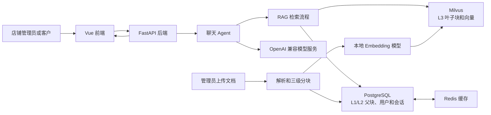
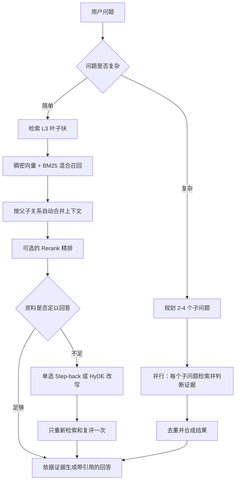

# AI智能知识检索系统

面向单店铺商品资料的 AI 智能知识检索与问答系统。它的核心工作不是直接凭模型记忆回答，而是先在店铺知识库中找到可追溯的资料，再基于资料生成回答并标注来源。

当前仓库提供了一套 **vivo 手机店铺** 的示例语料和固定评测集，适合演示和练习一个 RAG（检索增强生成）项目从“文档入库”到“评测与定位问题”的完整过程。

> RAG 可以简单理解为：**先找资料，再依据资料回答**。它适合商品参数、售后规则、产品手册等相对稳定的知识；订单、库存、物流等实时信息应接入业务 API，而不是只依赖文档检索。

## 项目能做什么

- 支持上传 Markdown、PDF、Word、Excel、HTML、TXT 文档，异步完成解析和入库。
- 使用三级分块保存长文档上下文：小块负责找得准，父块负责让回答看得全。
- 同时使用语义检索和关键词检索，兼顾“意思相近”和“型号、容量、价格等词必须命中”的场景。
- 对召回结果进行证据判断；资料不足时，最多执行一次查询改写后重新检索。
- 支持复杂问题拆成多个子问题并行检索，最后合并成一份回答。
- 支持 SSE 流式输出、停止生成、来源引用和 RAG 过程展示。
- 支持账号登录、会话隔离、管理员文档管理和会话摘要记忆。
- 内置 vivo 单品牌手机店铺示例语料、27 道固定评测题和基线评测脚本。

## 架构概览



| 组件 | 职责 |
| --- | --- |
| Vue 3 + Vite | 登录、聊天、文档管理、来源与检索过程展示。 |
| FastAPI | 认证、会话、上传任务、聊天接口和 SSE 流式响应。 |
| PostgreSQL | 用户、会话消息、L1/L2 父级分块。 |
| Redis | 父级分块和会话相关缓存。 |
| Milvus 2.5+ | L3 叶子块的稠密向量、原文和服务端 BM25 稀疏特征。 |
| Hugging Face Embedding | 将 L3 叶子块和用户问题转为稠密向量；默认模型为 `BAAI/bge-m3`。 |
| OpenAI 兼容模型服务 | 负责工具调用、复杂度判断、证据判断、查询改写和最终回答。 |

Docker Compose 会启动 PostgreSQL、Redis、etcd、MinIO、Milvus 和 Attu。Attu 是 Milvus 的可视化管理界面，默认端口为 `8080`；若配置了 `ATTU_HOST_PORT`，以该配置为准。

## 文档如何入库

上传一个文档后，后台会依次执行以下步骤：

1. 清理同名旧文档的索引，避免同一文件的新旧版本同时参与回答。
2. 按文件类型提取正文，并切成三级关联文本块。
3. 将 L1、L2 父级分块写入 PostgreSQL，同时尝试写入 Redis 缓存。
4. 只为 L3 叶子分块生成稠密向量，并写入 Milvus；Milvus 根据原文自动生成 BM25 稀疏特征。

### 三级分块与存储

| 层级 | 默认长度 / 重叠 | 存储位置 | 用途 |
| --- | --- | --- | --- |
| L1 | 2400 / 400 字符 | PostgreSQL + Redis 缓存 | 保存较完整的章节上下文。 |
| L2 | 1600 / 200 字符 | PostgreSQL + Redis 缓存 | 在上下文完整性和定位精度之间折中。 |
| L3 | 800 / 100 字符 | Milvus | 最小可检索单元，用来精确召回资料。 |

这种设计只把 L3 写入向量库，避免 L1/L2/L3 都向量化造成重复存储；当多个命中的 L3 属于同一个父块且达到阈值时，系统会自动向上合并为 L2 或 L1，再交给模型回答。

## 用户提问时发生了什么



### 检索与回答规则

1. **混合召回**：系统同时计算问题与资料的语义相似度，以及 BM25 关键词匹配分数；再用 RRF 融合排序，让被两种方式同时找到的资料更靠前。若混合检索异常，会自动降级为纯稠密向量检索。
2. **上下文合并**：初次命中的是 L3 小块。若同一父块有足够多个小块命中，系统会取回对应的 L2/L1 父块，降低“只看见一句参数，丢掉限定条件”的风险。
3. **可选精排**：如果同时配置了 `RERANK_MODEL`、`RERANK_BINDING_HOST` 和 `RERANK_API_KEY`，会调用兼容 `/v1/rerank` 的外部服务对候选资料重新排序。它不是强制依赖，也不是写死的某一家模型服务；实际某次回答是否使用精排，可在前端 RAG trace 的 `rerank_applied` 中查看。
4. **证据判断与一次改写**：系统会判断资料是否相关、是否足以回答、是否存在歧义。资料不足时，辅助模型在 Step-back（把问题退一步问更通用的知识）与 HyDE（先生成一段假设性检索描述）中只选一种，进行一次二次检索，避免无限循环和过多模型调用。
5. **生成回答**：最终回答只能依据召回资料中的事实，并用 `[1]`、`[2]` 等编号引用来源；资料不足时应明确说明知识库没有可靠信息，而不是编造答案。

复杂问题会先由 `FAST_MODEL` 规划子问题，再通过 LangGraph 并行完成各子问题的“检索 -> 证据判断”，最后合成回答。明显的单事实问题则直接进入检索，减少不必要的规划耗时。

## 快速开始

### 前置条件

- Windows 10/11、PowerShell 5.1 或 PowerShell 7。
- Docker Desktop，且 Docker Engine 已启动。
- Python 3.12+ 和 [uv](https://docs.astral.sh/uv/)，或可用的 Python 环境。
- Node.js 20+ 与 npm。
- 可用的 OpenAI 兼容模型服务。默认启动脚本会尝试启动 Ollama；也可以配置远程模型服务并在启动时跳过 Ollama。
- 本地可用的 Embedding 模型缓存，或允许首次下载 `BAAI/bge-m3`。

### 首次准备

在项目根目录执行：

```powershell
uv sync
Set-Location .\frontend
npm install
Set-Location ..
```

在根目录准备 `.env`。不要把密钥提交到 Git。至少需要根据所使用的模型服务检查以下变量：

```dotenv
# OpenAI 兼容模型服务
BASE_URL=
ARK_API_KEY=
MODEL=
FAST_MODEL=
GRADE_MODEL=

# 登录令牌签名
JWT_SECRET_KEY=

# 可选：本地向量模型
EMBEDDING_MODEL=BAAI/bge-m3
EMBEDDING_DEVICE=cpu
EMBEDDING_LOCAL_FILES_ONLY=true
```

可选配置包括 `RERANK_MODEL`、`RERANK_BINDING_HOST`、`RERANK_API_KEY`、`RETRIEVAL_TOP_K`、`AUTO_MERGE_THRESHOLD` 等。完整含义以对应后端源码中的默认值为准；不要在 README、截图或提交记录中暴露真实 API Key。

### 一键启动和停止

可以直接双击项目根目录中的脚本：

- `start.bat`：启动 Docker 服务、Ollama、后端和前端。
- `stop.bat`：停止本项目启动的前端、后端和 Docker 服务；不会关闭外部已经运行的 Ollama。

启动完成后访问：

- 前端：<http://127.0.0.1:3000/>
- 后端健康检查：<http://127.0.0.1:8050/health>
- FastAPI 接口文档：<http://127.0.0.1:8050/docs>

也可以在 PowerShell 中使用统一管理脚本：

```powershell
# 启动
pwsh -NoLogo -NoProfile -File .\scripts\supermew.ps1 -Action start

# 停止
pwsh -NoLogo -NoProfile -File .\scripts\supermew.ps1 -Action stop

# 重启
pwsh -NoLogo -NoProfile -File .\scripts\supermew.ps1 -Action restart

# 查看进程、端口和 Docker 状态
pwsh -NoLogo -NoProfile -File .\scripts\supermew.ps1 -Action status

# 查看托管的前后端日志
pwsh -NoLogo -NoProfile -File .\scripts\supermew.ps1 -Action logs
```

若使用外部模型服务且不希望脚本启动 Ollama：

```powershell
pwsh -NoLogo -NoProfile -File .\scripts\supermew.ps1 -Action start -NoOllama
```

运行日志位于 `tmp\ai-customer-service-dev\logs`。脚本支持 `-NoDocker`、`-NoBackend`、`-NoFrontend`、`-NoWait` 和 `-Foreground` 等选项，可用于本地调试。

## 使用方式

1. 注册账号并登录。管理员账号可上传、删除和查看知识库文档。
2. 在文档管理页面上传店铺资料，等待后台任务显示解析、父块入库和向量化入库完成。
3. 在聊天页提问，例如“X200 Pro 的卫星通信能力是什么？”或“Y200 和 S19 的前置相机分别是多少？”。
4. 在回答下方查看引用来源和 RAG 过程：召回了哪些资料、候选数量、是否精排、证据判断结果，以及是否发生过改写检索。
5. 生成过程中可以停止回答；对话记录会按用户隔离保存，较长历史会被压缩成会话笔记以控制上下文长度。

仓库中的 vivo 示例数据位于 `data/rag-samples/vivo-store-v1/knowledge/products/`。它包含 7 份 Markdown 商品资料；如本地知识库为空，请以管理员身份将这些文件上传后再做演示或评测。

## RAG 评测

项目不把“模型看起来回答得不错”当作评测结论，而是使用一套固定题目重复验证。当前示例评测集位于：

```text
data/rag-samples/vivo-store-v1/evaluation/test-cases.jsonl
```

每道题预先定义：

- 应该召回的商品资料；
- 回答必须包含的关键事实；
- 回答不能出现的错误说法。

评测脚本会登录真实的本地服务，逐题请求 `/chat`，保存系统回答、检索 trace、资料排名和耗时；默认再用独立模型按题目标准判卷。这样后续调整检索、分块或提示词时，可以使用同一批题目确认是否真正变好、有没有让其他题退化。

### 运行评测

先确认 7 份 vivo 样例资料已上传、服务正在运行，并为评测账户设置密码环境变量：

```powershell
$env:EVAL_PASSWORD = '<评测账户密码>'
uv run python .\scripts\run_rag_baseline.py `
  --username '<评测账户用户名>' `
  --output .\output\rag-evaluations\baseline-local.jsonl
```

默认开启回答判卷，因此 `.env` 中还需要 `BASE_URL`、`ARK_API_KEY`、`GRADE_MODEL`。只想检查“应找的资料是否被找到”，不调用判卷模型时：

```powershell
uv run python .\scripts\run_rag_baseline.py `
  --username '<评测账户用户名>' `
  --answer-grading off
```

运行后会在 `output/rag-evaluations/` 生成三类文件：

- `*.jsonl`：逐题原始记录；
- `*.summary.json`：汇总指标；
- `*.report.md`：可阅读的逐题成绩单。

### 当前基线结果

基线使用 7 份 vivo 商品资料和 27 道固定题，完整运行记录见 [docs/rag-baseline-evaluation.md](docs/rag-baseline-evaluation.md)。截至 2026-08-11，已完成的一次完整运行结果如下：

| 指标 | 基线结果 |
| --- | ---: |
| 接口成功返回 | 27 / 27 |
| 正确资料全部找到 | 26 / 27（96.3%） |
| 回答通过 | 24 / 27（88.9%） |
| 必答事实覆盖 | 51 / 55（92.7%） |
| 禁答项误答 | 0 / 37 |
| 平均单题耗时 | 26.473 秒 |

这些数字是当前基线，不代表“已经完成优化”。后续每一次改动都应先说明要解决的具体失败题，再用同一份 27 题集完整重跑。若运行受上游模型限流、网络或额度影响而中断，不能将不完整结果与基线直接比较。

## 面试中如何讲这个项目

可以按“发现问题 -> 定位原因 -> 修改方案 -> 验证结果”的顺序说明，而不是只罗列技术名：

1. **先建立可重复的业务场景**：把系统限定为单品牌 vivo 手机店铺客服，用真实结构的商品 Markdown 资料替代泛泛的“通用知识库”。
2. **先记录基线**：设计覆盖单型号参数、多型号对比、价格和资料缺失情况的固定题集，先跑出真实结果。
3. **区分检索问题和回答流程问题**：例如某道失败题可能是“资料没有找到”，也可能是“资料已找到但模型没有正常回答”。两种问题不能用同一种优化方法处理。
4. **做小范围、可解释的改动**：比如调整分块、召回排序、证据判断或资料不足时的处理，而不是一次修改很多模块。
5. **用相同题集复测**：比较召回率、回答通过率、错误回答和延迟，并人工复核失败题。没有完整复测的数据，不宣称系统“整体提升”。

当前基线中已有失败题的人工复核和边界分析，详见 [docs/rag-baseline-evaluation.md](docs/rag-baseline-evaluation.md)。

## 项目目录

```text
.
├── backend/                         # FastAPI、RAG、索引、数据存储和工具
│   ├── api/                         # 认证、会话、聊天、文档接口
│   ├── chat/                        # Agent 运行时、流式输出、会话上下文
│   ├── indexing/                    # 文档解析、三级分块、Embedding、Milvus 写入
│   ├── rag/                         # 检索、自动合并、精排、证据判断、查询改写
│   └── tools/                       # 知识库检索和天气工具示例
├── frontend/                        # Vue 3 前端
├── data/rag-samples/vivo-store-v1/  # vivo 示例语料与固定评测题
├── docs/                            # 评测记录与项目文档
├── output/rag-evaluations/          # 评测原始结果和报告
├── scripts/                         # 启停与评测脚本
├── docker-compose.yml               # PostgreSQL、Redis、Milvus 等基础服务
├── start.bat                        # Windows 一键启动
└── stop.bat                         # Windows 一键停止
```

## 当前边界与后续方向

- 当前知识库面向静态或低频变化的店铺资料。库存、订单、物流、优惠券、实时价格等问题应通过可扩展工具接入真实业务系统。
- Rerank 精排是可选能力，是否启用取决于环境配置和回答 trace，不能只凭代码存在就宣称每次回答都使用了它。
- 评测中的模型判卷适合批量筛查，但对业务口径有歧义的题目仍需要人工复核；评测标准应先与店铺规则保持一致。
- 当前示例语料规模较小，适合验证分块、检索、引用与评测流程。接入更大的真实知识库前，应补充更多文档类型、长文档、同义问法和资料缺失场景的测试题。
