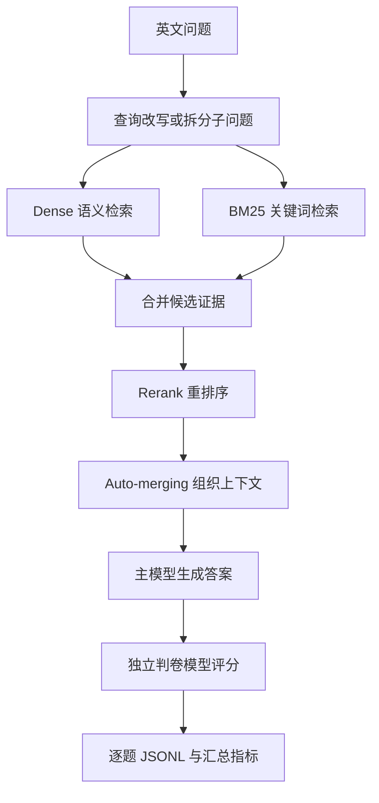

# EnterpriseRAG 英文正式评测说明

## 先看结论

本轮评测回答的是一个明确的问题：

> 在一套受控的企业英文文档库里，当前 EnterpriseRAG 能不能找到正确资料，并据此给出完整、准确的答案？

正式基线使用 7,222 篇英文文档和 500 道题。最终评测完成 `500/500`，没有评测链路错误：

| 指标 | 结果 | 白话解释 |
| --- | ---: | --- |
| 回答通过率 | 52.40% | 独立判卷认为完整、正确的回答比例 |
| 证据全覆盖率 | 70.00% | 标准证据文件全部出现在最终证据中的题目比例 |
| 平均证据覆盖率 | 74.66% | 每道题命中的标准证据比例取平均 |
| 正确拒答率 | 95.00% | 没有可靠资料时，系统正确说“不知道”的比例 |
| 端到端延迟 P50 | 72.19 秒 | 一半题目在 72.19 秒内完成 |

当前最大问题不是所有资料都找不到，而是：**复杂问题中，证据没有被完整组织进最终回答，或者回答混入了相邻资料。**

这是一份基线和失败诊断，不是优化后的成绩，也不是 EnterpriseRAG 官方全量排行榜成绩。

## 1. 这次到底测了什么

### 1.1 正式语料

正式评测只使用 EnterpriseRAG 原始英文内容的 `title + content`，不使用中文翻译语料。

| 文档角色 | 数量 | 作用 |
| --- | ---: | --- |
| 标准证据文档 | 722 | 出题时规定的正确来源 |
| 普通干扰文档 | 6,500 | 内容相关但通常不是本题答案的资料 |
| 合计 | 7,222 | 本轮 Representative 语料 |

这些文档写入评测专用集合：

`rag_eval_enterpriserag_enterpriserag_en_representative_sf_001`

它与默认业务集合 `tutorial_verify_embeddings` 隔离。评测过程没有操作默认业务集合。

### 1.2 500 道题如何使用

500 道题被固定拆成两个互不重叠的集合：

| 集合 | 数量 | 用途 | 是否公开逐题详情 |
| --- | ---: | --- | --- |
| analysis | 300 | 找失败原因、决定后续实验方向 | 可以核查 |
| validation | 200 | 检验优化是否能泛化 | 保持盲态 |

`analysis` 可以理解为“诊断用题”；`validation` 可以理解为“考试题”。如果先看 validation 的题目、标准答案和失败原因，再去调参数，就无法公平验证泛化能力。

中文 smoke 只保留审计记录，不参与这组正式英文结论。

## 2. 一道题是怎样被评测的



### 2.1 检索

系统先从评测专用集合中找候选资料：

- **Dense 检索**：按语义相似度找表达方式相近的内容；
- **BM25**：按关键词匹配找包含关键术语、数值或专有名词的内容；
- **Hybrid（混合检索）**：结合 Dense 和 BM25；
- **Rerank（重排序）**：对候选资料再次排序，把更可能直接回答问题的内容放到前面。

正式 RAG 基线沿用冻结的检索参数和 Rerank 配置，没有在基线前调参。

### 2.2 证据组织

检索得到的不是一段已经写好的答案，而是一组文档片段。系统会根据需要：

- 合并同一文档的相邻片段；
- 把多个子问题的证据组织到同一上下文；
- 通过 Auto-merging（自动合并）尽量恢复完整段落。

这一步很重要：**文件被召回，不代表关键句一定进入了最终上下文。**

### 2.3 生成与判卷

主模型根据最终上下文生成回答。随后由独立的 `GRADE_MODEL` 对照以下三项进行判卷：

1. 原问题；
2. 标准答案；
3. 模型回答。

独立判卷输出三种结果：

| 判定 | 含义 |
| --- | --- |
| `pass` | 回答满足问题和标准答案 |
| `fail` | 回答错误、不完整或超出问题范围 |
| `review` | 自动判卷无法可靠决定，需要人工确认 |

判卷请求失败、答案生成超时等属于评测链路问题，不能直接当作模型质量失败。

## 3. 指标是怎么算的

指标实现位于 [backend/evaluation/metrics.py](E:/mystudy/agent_study/SuperMew/backend/evaluation/metrics.py)。

### 3.1 回答通过率：52.40%

500 道题的判卷结果是：

| 判定 | 数量 |
| --- | ---: |
| pass | 262 |
| fail | 203 |
| review | 35 |

计算方式：

```text
回答通过率 = pass 数量 / (pass + fail + review)
            = 262 / 500
            = 52.40%
```

`review` 计入分母，但不计入通过数。因此这是一个偏保守的自动基线指标。

### 3.2 证据全覆盖率：70.00%

每道可回答题都有一个标准证据文件清单。系统检查这些文件是否全部出现在最终检索证据中。

本次：

```text
可回答题数量 = 480
标准证据全部命中的题数 = 336
证据全覆盖率 = 336 / 480 = 70.00%
```

20 道 `info_not_found` 题本来就没有应当被找到的标准答案文档，因此不放进这个分母。

注意：这个指标只检查“正确文件是否出现”，不检查模型是否真正读懂并使用了关键句。

### 3.3 平均证据覆盖率：74.66%

逐题计算：

```text
单题证据覆盖率 = 命中的标准证据文件数 / 该题要求的标准证据文件数
```

例如，一道题要求 4 篇标准证据，最终命中 3 篇，则该题覆盖率为 75%。最后对 500 道题取平均：

```text
所有题的覆盖率总和 = 373.3095
平均证据覆盖率 = 373.3095 / 500 = 74.66%
```

无答案题没有标准证据文件时，覆盖率按题目定义处理为完整覆盖；因此平均覆盖率不能直接理解成“所有答案都有 74.66% 的正确内容”。

### 3.4 正确拒答率：95.00%

只看 20 道明确设计为“知识库没有可靠答案”的 `info_not_found` 题：

```text
正确拒答 = 19
无答案题总数 = 20
正确拒答率 = 19 / 20 = 95.00%
```

这个指标衡量的是系统会不会在没有证据时编造答案。

### 3.5 延迟

P50 是中位数：一半题目比这个数更快，另一半更慢。

| 阶段 | P50 |
| --- | ---: |
| 端到端 | 72.19 秒 |
| RAG 阶段 | 35.88 秒 |
| 回答生成 | 15.51 秒 |

单次模型请求仍保持 90 秒上限；本轮唯一改变的是外层单题总时限从 300 秒调整为 600 秒，以便恢复之前的 3 道失败题。

## 4. 基线结果说明了什么

按题型看，简单单事实题明显好于复杂综合题：

| 题型 | 回答通过率 |
| --- | ---: |
| `miscellaneous` | 80.0% |
| `basic` | 68.0% |
| `intra_document_reasoning` | 62.5% |
| `semantic` | 39.2% |
| `constrained` | 36.7% |
| `completeness` | 25.0% |
| `high_level` | 10.0% |
| `project_related` | 5.0% |

这说明当前系统最难处理的是：

- 需要列全多个角色、步骤、条件或例外的题；
- 需要跨项目资料组合的题；
- 对日期、数值、版本、范围非常敏感的题；
- 需要区分相似方案、旧方案和当前方案的题。

## 5. T8 失败分析：失败到底发生在哪里

T8 只分析 300 道 analysis 题，先自动初筛，再人工复核。

### 5.1 自动初筛

自动判卷结果：

- `153 pass`
- `123 fail`
- `24 review`

自动分类是“优先检查哪些题”的分诊，不是最终根因。一个题可以同时属于多个类别，所以分类数量不能相加当作失败总数。

### 5.2 人工复核后的主要根因

| 人工结论 | 数量 | 说明 |
| --- | ---: | --- |
| 自动判定改为通过 | 21 | 核心回答成立，自动判卷对轻微差异或额外信息过严 |
| 回答通过但证据不足 | 4 | 答案碰巧正确，最终证据没有完整支持 |
| 确认回答合成失败 | 37 | 遗漏、范围漂移、冲突值/步骤或相邻资料污染 |
| 确认证据上下文失败 | 7 | 文件级召回存在，但关键细节没有进入最终上下文 |
| 答案失败且伴随判卷异常 | 1 | 判卷 API 返回 402，另有人工可确认的错误回答 |
| 系统异常、质量不可判 | 1 | 生成超时且没有答案 |

因此当前最可信的诊断是：**主要瓶颈在证据组织和答案合成，不只是“有没有搜到文档”。**

## 6. 用几个例子理解失败类型

以下例子都来自 analysis 集，validation 题目不会写入这份文档。

### 例子一：回答方向对，但没有回答完整

题目问 GCP 团队如何处理订阅权限延迟。标准答案要求说明 pending 状态、同步提示、重试和支持流程；模型只回答“让 onboarding 流程能够应对权限传播延迟”。

问题：概括方向正确，但漏掉了题目真正要求的操作细节。

### 例子二：答对一半，又混入相邻方案

题目问快速启动模板的 HTTP header。模型正确写出了 `X-Redwood-Template` 和格式，但又加入了另一个相邻资料中的 `x-redwood-template-tags` 方案。

问题：不是完全不会，而是没有严格限制回答范围。

### 例子三：答案基本正确，但证据不完整

题目问超过审计日志保留期限后使用哪种机制。模型正确回答应使用 Legal Hold，但最终证据没有完整支持 `legal_hold_id`、租户开关和审计记录等关键限定。

问题：回答正确不能反过来证明检索和证据链完整。

### 例子四：系统超时，不能算模型质量失败

有一道题标准答案是“1,800 requests/sec，持续 60 秒”，但生成请求超时，模型回答为空。

问题：这是生成链路异常，应该保留为 `system_error`，不能据此判断模型不会回答。

## 7. 评测产物如何互相对应

每个正式实验目录都保存以下文件：

| 文件 | 用途 |
| --- | --- |
| `evaluation-config.json` | 本轮模型、检索参数、题集和代码版本快照 |
| `results.jsonl` | 完整逐题机器审计源，包含受控的 validation 记录 |
| `summary.json` | 结构化汇总指标 |
| `report.md` | 汇总报告 |
| `case-review.md` | 便于人阅读的逐题报告 |
| `manual-review.jsonl` | 人工复核队列和结论 |
| `manual-review.md` | 人工复核队列的人类可读版本 |
| `evaluation-progress.json` | 断点续跑和完成状态 |

`results.jsonl` 是完整机器审计源，不等于公开报告。正式 split 下，自动报告和可读复核文件不会展示 validation 的题目、答案或失败细节；未来自动生成的人工队列只保留不含题号和内容的匿名 marker。

## 8. 为什么没有直接开始优化

如果同时修改 Embedding、top-k、Rerank、提示词和分块，就无法知道结果变化来自哪一项。因此后续实验必须遵守：

1. 先根据 T8 选择一个明确假设；
2. 每轮只改一个变量；
3. 使用新的 `evaluation_id`；
4. 记录 `changed_variable` 和完整配置快照；
5. 先看 analysis 结果；
6. 最后再用保持盲态的 validation 检验是否泛化。

当前状态是：

- T7：已完成；
- T8：自动初筛和 analysis 人工复核已完成；
- T9：未开始；
- 没有修改 RAG 参数，也没有重新入库。

下一步需要先确定唯一优化变量，才能开始可解释的单变量实验。

## 9. 术语速查表

| 术语 | 人话解释 |
| --- | --- |
| RAG | 先查资料，再让模型根据资料回答 |
| 语料库（corpus） | 系统可以查询的全部文档 |
| 标准证据 | 出题时规定的正确来源 |
| 干扰文档 | 看起来相关但不是本题正确来源的文档 |
| Embedding | 把文字转换成数字，方便比较语义相似度 |
| Dense 检索 | 按语义相似度找资料 |
| BM25 | 按关键词找资料 |
| Hybrid | 同时使用 Dense 和 BM25 |
| Rerank | 对初步找出的资料重新排序 |
| Auto-merging | 把分散的片段合并成更完整的上下文 |
| Multi-hop | 需要多次检索或多个证据才能回答的问题 |
| evidence coverage | 标准证据文件被找中的比例 |
| `pass/fail/review` | 自动判卷的通过、失败和待人工确认 |
| 独立判卷 | 让另一个模型检查主模型的回答 |
| analysis | 用来诊断和调参的 300 道题 |
| validation | 保持盲态、用来检查泛化的 200 道题 |
| P50 | 中位数，一半样本更快、一半更慢 |
| evaluation ID | 一轮实验的唯一名字，避免覆盖其他结果 |
| 单变量实验 | 每轮只改变一个因素的对照实验 |
